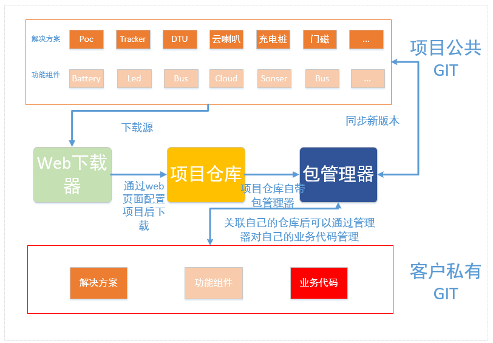

# QuecPython包管理器&代码生成平台设计文档

## 背景

为方便客户使用QuecPython进行项目开发,我们开发了许多基于业务的解决方案和基于功能的组件代码来帮助客户更好更快的进行开发,但是目前繁多的解决方案和组件代码没有一个途径汇总和展示出来,为了方便客户使用和贡献代码,同时也方便内部管理,计划通过一个离线的git命令行工具来实现项目和代码的管理

## 功能设计

### 流程框图

### 功能组成

业务平台&组件代码 + 包管理器 + web端下载器

略

## 详细设计

### 业务平台&组件代码

#### 业务平台

| 业务平台 | 仓库路径              | 仓库备注     |
| -------- | --------------------- | ------------ |
| Poc      | qpylibs/Poc           | 对讲机仓库   |
| Tracker  | qpylibs/Tracker       | tracker仓库  |
| DTU      | qpylibs/DTU           | DTU仓库      |
| 学生卡   | qpylibs/SmartFridge   | 学生卡仓库   |
| 门磁     | qpyibs/MagneticDoor   | 门磁仓库     |
| 充电桩   | qpylibs/CharigPile    | 充电桩仓库   |
| 云喇叭   | qpylibs/CloudHorn     | 云喇叭仓库   |
| 智能药盒 | qpylibs/SmartPillBoxs | 智能药盒仓库 |
| ...      |                       | 持续新增中   |

#### 组件代码

| 组件代码 | 仓库路径 | 仓库备注 |
| -------- | -------- | -------- |
|          |          |          |
|          |          |          |
|          |          |          |
|          |          |          |
|          |          |          |
|          |          |          |
|          |          |          |
|          |          |          |
|          |          |          |

### 包管理器

#### 功能介绍

通过python实现的命令行脚本工具，以类似于Git的方式来管理本地代码，可以实现本地文件和远程仓库的管理，通过GitPython库实现远程git管理操作，通过shutil库来实现本地代码管理，通过click库实现命令行相关操作，只需通过相应命令即可完成复杂的Git操作和代码同步，无需学习Git命令即可对本地代码仓库进行管理

*部分复杂Git操作需要以依赖本地Git环境*

该命令行工具名称下文中暂定为 **QuecPython**

#### 详细功能

##### 获取工具功能列表

> QuecPython --help

- 参数

不传或者传入 **--help**

- 返回值

返回工具可用的命令列表和对应的命令功能介绍

##### 获取工具版本

> QuecPython --version

- 参数

传入 **--version**

- 返回值

返回工具版本

##### 获取代码

> QuecPython import

- 参数

| 参数     | 参数类型 | 参数说明                                                 |
| -------- | -------- | -------------------------------------------------------- |
| 代码类型 | string   | **package**:业务平台代码 **component**: 功能组件代码 |
| 代码名称 | string   | 上文表格中的业务平台和功能组件的名称                     |

- 返回值

在当前目录下生成以代码名称为名的代码仓库

- 备注

当拉取业务平台代码时会一并拉取对应的子仓库,当不加参数输入命令时会显示所以可输入的参数列表(可以拉取的代码列表和介绍)

##### 获取当前路径远程仓库名称

> QuecPython get
>

- 参数

无

- 返回值

返回当前仓库名称和远程URL

- 备注

##### 获取当前路径远程仓库版本

> QuecPython getVersion
>

- 参数

无

- 返回值

返回当前代码的远程仓库版本

- 备注

##### 检查当前路径代码版本是否有更新

> QuecPython checkUpdate

- 参数

无

- 返回值

有版本更新时会返回

| 参数     | 参数类型 | 参数说明   |
| -------- | -------- | ---------- |
| 代码名称 | string   |            |
| 当前版本 | string   | eg：v1.0.0 |
| 最新版本 | string   | eg：v1.0.1 |

无版本更新时无返回值

- 备注

当代码类型为**package**时，会同步检查该**package**下的**component**是否有更新

##### 更新当前路径代码版本

> QuecPython update

- 参数

| 参数    | 参数类型 | 参数说明                      |
| ------- | -------- | ----------------------------- |
| version | string   | 更新到指定版本 eg: V1.1.0 |

传入**--force**会强制覆盖本地仓库的代码

- 返回值

更新到当前代码的远程仓库release的最新版本，当代码类型为**package**时，会同步更新该**package**依赖的**component**版本

##### 列出当前路径代码依赖关系

> QuecPython ls

- 参数

无

- 返回值

以树结构列出当前目录下的代码依赖关系和代码对应的远程仓库

##### 初始化本地仓库

> QuecPython init

- 参数

无

- 返回值

在当前路径初始化一个新仓库

##### 配置远程仓库账号密码

> QuecPython config

- 参数

| 参数     | 参数类型 | 参数说明 |
| -------- | -------- | -------- |
| email    | string   | 邮箱     |
| username | string   | 用户名   |
| passwd   | string   | 密码     |

- 返回值

无

##### 移除当前路径代码仓库

> QuecPython remove

- 参数

无

- 返回值

移除当前路径下的代码仓库以及依赖的子仓库也一并删除

##### 关联远程代码仓库

> QuecPython add

- 参数

| 参数 | 参数类型 | 参数说明                        |
| ---- | -------- | ------------------------------- |
| name | string   | 新增的仓库名称                  |
| url  | string   | 想要关联的远程仓库url（空仓库） |

- 返回值

显示当前仓库关联的远程仓库列表（形式：名称 url）

##### 切换远程代码仓库

> QuecPython switch

- 参数

| 参数     | 参数类型 | 参数说明                        |
| -------- | -------- | ------------------------------- |
| url/name | string   | 想要切换到的远程仓库url或者name |

- 返回值

切换到设置的远程仓库

##### 查看本地代码仓库状态

> QuecPython status

- 参数

无

- 返回值

显示当前仓库状态，包括更改的文件

##### 查看远程代码仓库日志

> QuecPython log

- 参数

无

- 返回值

显示远程仓库提交日志状态

##### 查看本地代码仓库操作日志

> QuecPython reflog

- 参数

无

- 返回值

显示本地仓库的操作日志记录

##### 清除本地代码多余文件

> QuecPython clean

- 参数

`-n`：显示哪些文件会被删除。记住他不会真正的删除文件, 只是一个提醒。（也就是查看可使用`git clean`命令清除的文件）

`-f`：删除当前目录下所有没有被git记录的文件

- 返回值

显示本地仓库的操作日志记录

- 备注

从当前的工作目录中，删除所有未被Git追踪过的文件

##### 提交代码到本地仓库

> QuecPython commit

- 参数

| 参数     | 参数类型 | 参数说明                   |
| -------- | -------- | -------------------------- |
| msg      | string   | 提交信息                   |
| filename | string   | 想要提交的文件，可以是多个 |

- 返回值

切换到设置的远程仓库

##### 推送代码到远程仓库

> QuecPython push

- 参数

| 参数 | 参数类型 | 参数说明                                        |
| ---- | -------- | ----------------------------------------------- |
| name | string   | 想要提交的远程仓库 默认是当前指向的远程仓库 |

- 返回值

显示提交的结果信息

##### 导出项目文件夹

> QuecPython export

- 参数

无

- 返回值

会将当前目录下仓库打包成目录结构简单的项目文件夹，并且移除git配置文件和项目无关文件，生成的文件夹可以直接导入到模块中进行测试

### web端

#### 功能简介

通过web页面配置可以对公版解决方案的功能组件进行裁剪

例如选择了POC后可以选择是否需要UI,对讲平台,配套功能等,配置完成后可以下载配置后的git仓库,包含.git文件以及包管理器

#### 详细功能

页面代码下载流程

1. 页面选择需要的公版解决方案平台，可以在页面上选择想要的版本，默认拉取release的最新版本
2. 选择了解决方案之后可以在页面中对该解决方案依赖的功能组件进行裁剪并且可以选择其他功能组件,选择的其他功能组件会以依赖功能组件的形式一并打包
3. 选择完成之后选择下载代码会将对应版本的仓库打包下载
4. 下载到本地的代码会带有.git文件

流程图

